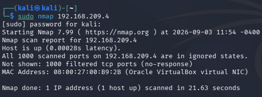
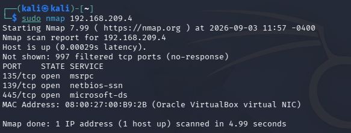
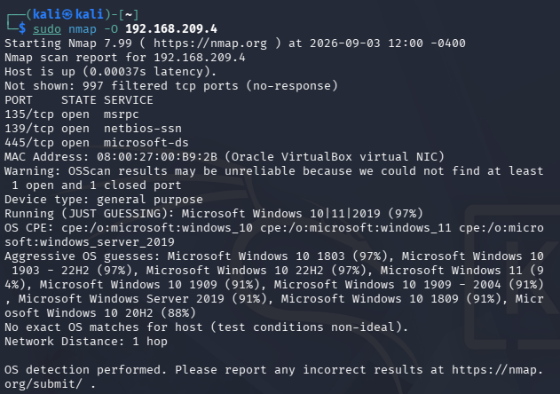
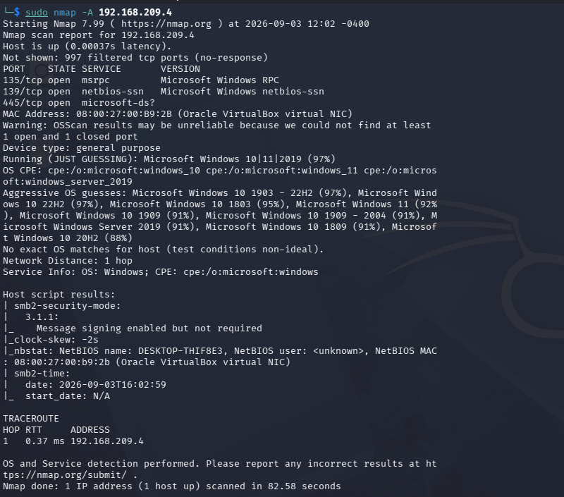

# NMAP SCANS 

# Basic Scan
First Nmap Scan
Used:
sudo nmap 192.168.209.4
- Showed no open ports

- Allowed all file and printer sharing options on the Windows VM firewall and got a more successful Nmap scan 

# OS Detection Scan
Used:
sudo nmap -O 192.168.209.4
Showed possible OS that the Windows VM had 

# Aggresive scan
Used:
sudo nmap -A 192.168.209.4
A combination of several other commands that shows valuable information from the Windows VM such as the ports AND potential OS

# Findings
- Open ports: 135, 139, 445
- OS fingerprint suggests Windows 10
- Firewall changes directly affected scan results
