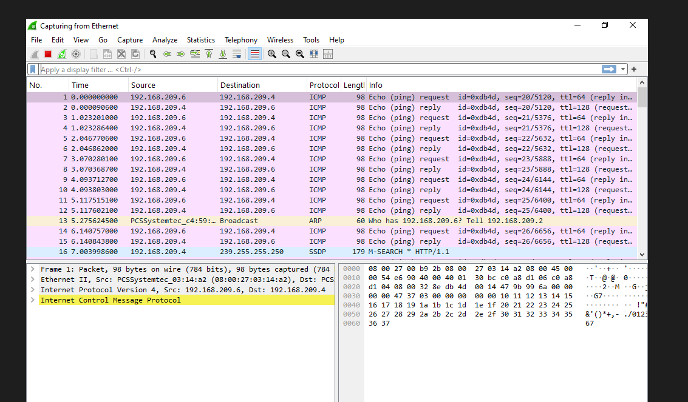

# VirtualBox Networking Configuration

(All relevant screenshots in the screenshot folder)
# Adapter 1 - Host-Only
Purpose: Internal lab network for attacking other VMs (E.g. Windows) 

# Adapter 2 - NAT
Purpose: Internet access for Kali tools and updates

# Verification
Inside Kali:
ip a

# Troubleshooting
Struggled with the host-only adapter, had to disable and enable it, delete it and create it again 
    - Fix was to enable DHCP and set the adapter to automatically configure 

Windows VM is now properly 192.168.209.4 whereas previously had IPv4 addresses beginning with 10. and 169. which was wrong was due to incorrect configuration of the host-only adapter

# Pings
Opened Wireshark on Windows VM and began pinging it from the Kali VM and saw the pings being displayed

